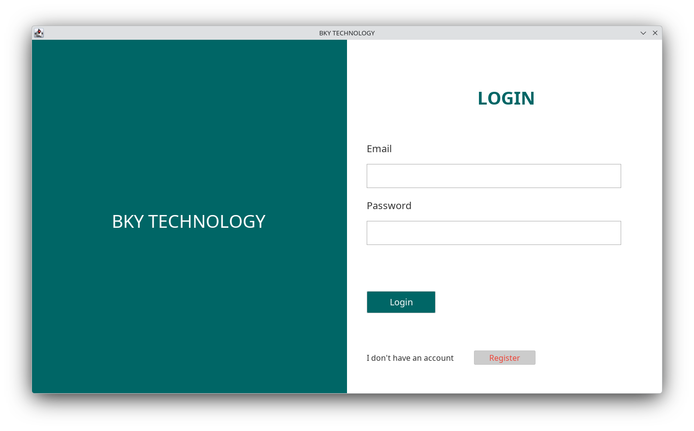
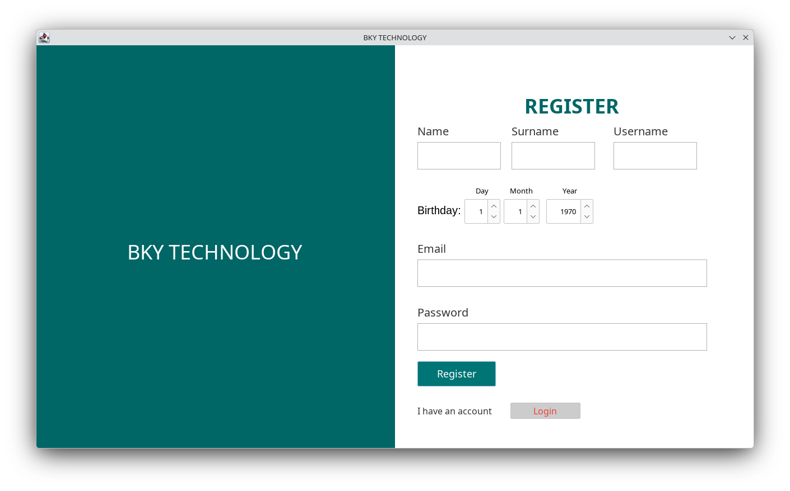
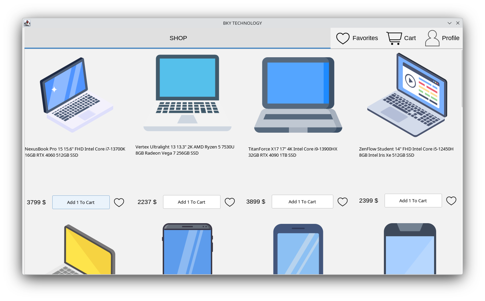
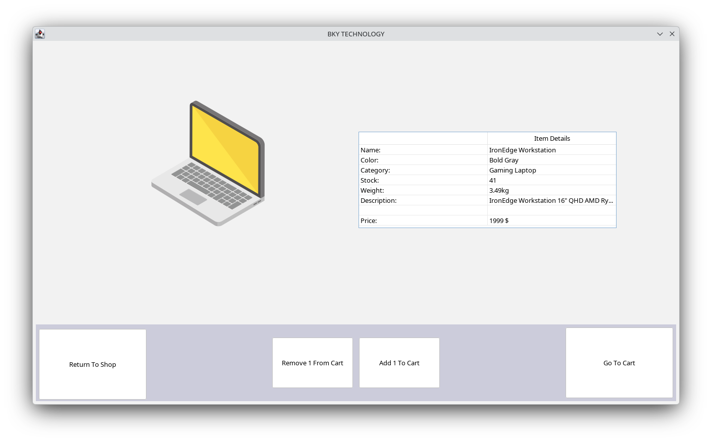
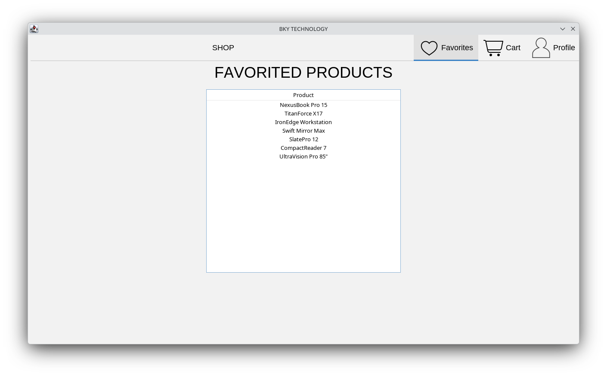
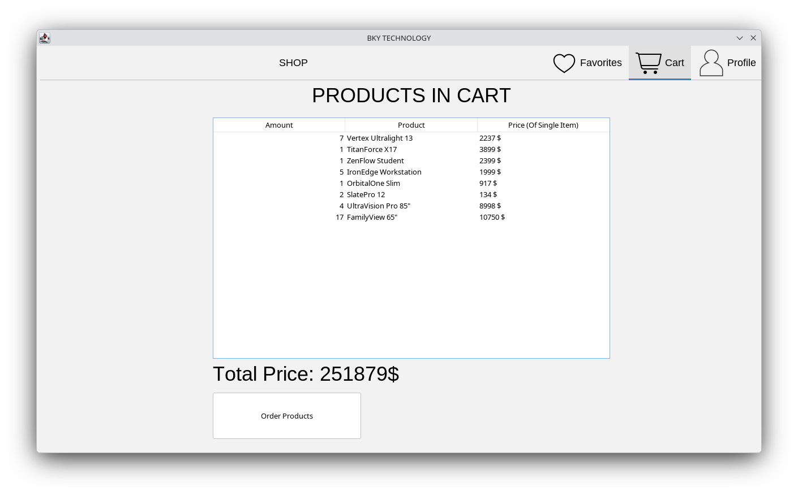
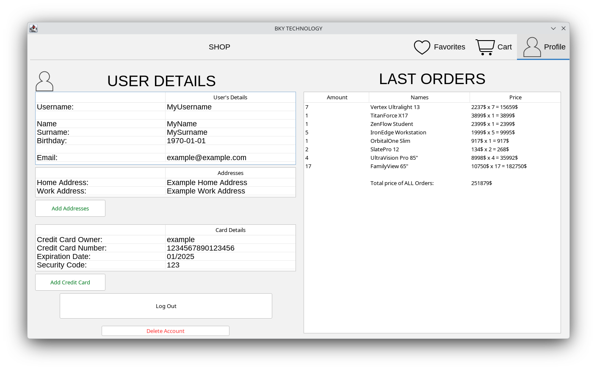

# E-Commerce-Project
A team project of a Java e‑commerce GUI with JavaFX for the UI and SQLite for data storage. It implements product browsing, favorite selection, cart management, order processing and stock control. Showcasing a complete desktop‑shopping solution. This project has used Java, SQLite, SQLite-Browser and Netbeans for development.

| Login Page             | Register Page            |
| ---------------------- | ---------------------- |
|  |  |

| Shopping Browser Page | Item Details Page |
| - | - |
|  |  |

| Favorites Page | Shopping Cart Page |
| - | - |
|  |  |

| Profile Page |
| - |
||

## Dependencies
- This project requires JDK 21 or higher.
- The Java SQLite library and the flatlaf library that is needed is included inside the project.

## Installation
1) Either clone this repository, or download the zip (if downloaded as zip, extract it)
2) Open Netbeans and Click "Open Project" (Ctrl+Shift+o) and then find the directory where the project is cloned/downloaded.
3) Netbeans should recognise the project and load it.
4) When the project is loaded, Click "Run Project" (F6)

## Contributors
This project was developed by:
- **Yaşar Mert Türkmen**
- **Mustafa Kaan Nart**
- **Barış Bursalı**
